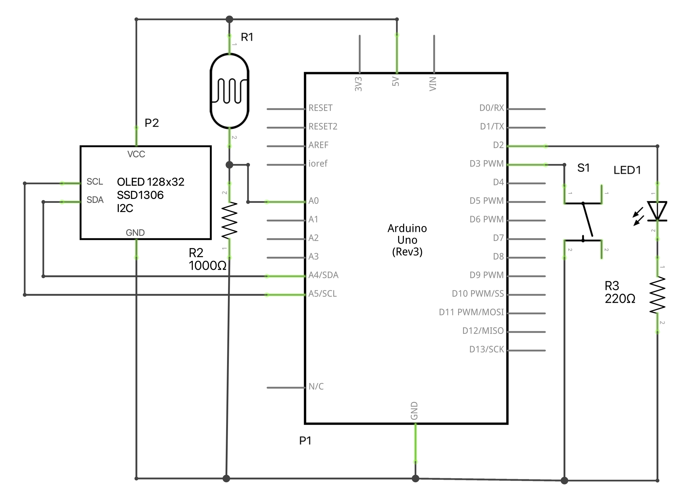

# Lux Meter

`Lux Meter` is an [`Arduino Uno`](https://www.arduino.cc/en/Main/arduinoBoardUno&gt;) project for measuring brightness, in units of [`lux`](https://en.wikipedia.org/wiki/Lux), and communicate it over `Serial`. It can be used in combination with the [WeMO](https://www.wemo.com/products/) [Smart Plug Control](https://github.com/kriztioan/WeMo) software.

`Lux Meter` transmits the brightness every 10s and keeps track of ~16 minutes of historic data that is presented on the `OLED`, connected via `I2C`, as a graph.

## Schematic

## Parts List

label|part
-----|----
|LED1|red LED|
|P1|Arduino Uno|
|P2|128x64 OLED|
|R1|photo cell|
|R2|1kΩ resistor|
|R3|220Ω resistor|
|S1|push button|

## Code

The code is written in `C++` and can be compiled and uploaded to the `UNO` using either the `Arduino IDE` or `PlatformIO`. The table below lists `Lux Meter`'s library dependencies together with the functionality they provide.

|library|functionality|
--------|--------------
|`Arduino`|`Arduino` support|
|`Wire`|`I2C` communication|
|[`u8g2lib`](https://github.com/olikraus/u8g2)|`OLED` `I2C` display routines|

## Usage

The red `LED` will blink when data is send over the `Serial` connection.The `OLED` screen can be turned off/on using the button.

## Notes

1. Every 40ms (25 `Hz`) a measurement is taken.

## BSD-3 License

Redistribution and use in source and binary forms, with or without modification, are permitted provided that the following conditions are met:

1. Redistributions of source code must retain the above copyright notice, this list of conditions and the following disclaimer.

2. Redistributions in binary form must reproduce the above copyright notice, this list of conditions and the following disclaimer in the documentation and/or other materials provided with the distribution.

3. Neither the name of the copyright holder nor the names of its contributors may be used to endorse or promote products derived from this software without specific prior written permission.

THIS SOFTWARE IS PROVIDED BY THE COPYRIGHT HOLDERS AND CONTRIBUTORS "AS IS" AND ANY EXPRESS OR IMPLIED WARRANTIES, INCLUDING, BUT NOT LIMITED TO, THE IMPLIED WARRANTIES OF MERCHANTABILITY AND FITNESS FOR A PARTICULAR PURPOSE ARE DISCLAIMED. IN NO EVENT SHALL THE COPYRIGHT HOLDER OR CONTRIBUTORS BE LIABLE FOR ANY DIRECT, INDIRECT, INCIDENTAL, SPECIAL, EXEMPLARY, OR CONSEQUENTIAL DAMAGES (INCLUDING, BUT NOT LIMITED TO, PROCUREMENT OF SUBSTITUTE GOODS OR SERVICES; LOSS OF USE, DATA, OR PROFITS; OR BUSINESS INTERRUPTION) HOWEVER CAUSED AND ON ANY THEORY OF LIABILITY, WHETHER IN CONTRACT, STRICT LIABILITY, OR TORT (INCLUDING NEGLIGENCE OR OTHERWISE) ARISING IN ANY WAY OUT OF THE USE OF THIS SOFTWARE, EVEN IF ADVISED OF THE POSSIBILITY OF SUCH DAMAGE.
