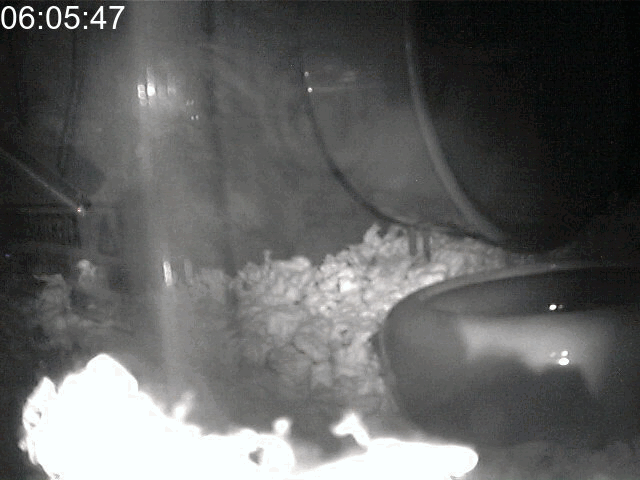
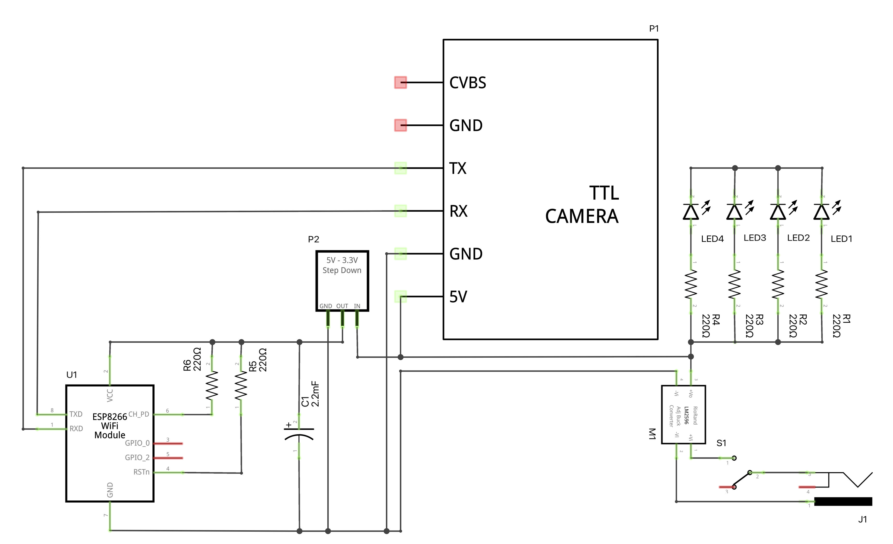

# Nite Cam

`Nite Cam` is an [`ESP8266`](https://www.espressif.com/en/products/socs/esp8266) project that provides a web-interface to take pictures via the `Serial`-connected `VC0706` camera module. Four `IR` `LEDs` provide night time illumination.

The project includes a `daemon` written in `PHP` to record time-lapses and a `bash` script that invokes  `FFMPEG` to generate a video from the collected series of `JPEGs`.



## Schematic



## Parts List

label|part
-----|----
|C1|2.2mF electrolytic capacitor|
|J1|9V power jack|
|LED1|IR LED|
|LED2|IR LED|
|LED3|IR LED|
|LED4|IR LED|
|M1|LM2596|
|P1|TTL Serial JPEG Camera|
|P2|5V-3.3V converter|
|R1|220Ω resistor|
|R2|220Ω resistor|
|R3|220Ω resistor|
|R4|220Ω resistor|
|R5|220Ω resistor|
|R6|220Ω resistor|
|S1|toggle switch|
|U1|ESP8266|

## Code

The `ESP8622` code is written in `C++` and can be compiled and uploaded using either the `Arduino IDE` or `PlatformIO`. The table below lists `Nite Cam`'s library dependencies together with the functionality they provide.

|library|functionality|
--------|--------------
|`ArduinoOTA`|over-the-air updates|
|`ESP8266WebServer`|webserver|
|`ESP8266WiFi`|WiFi control|
|`ESP8266mDNS`|multi-cast DNS support|
|`TZ`|timezone information|
|`coredecls`|NTP callback support|

## Usage

Connect to the `ESP8622` through a web browser by going to `http://nitecam.local/`. The presented page will refresh every 30s with an updated image. Going to `http://nitecam.local/status` provides a page showing the status and configuration of the `VC0706` camera module.

The `deamon` written in `PHP` (`NiteCam.php`) will retrieve an image every 30s between the hours of 8PM and 8AM. The images are timestamped and kept organized by date in separate directories, keeping images from a single night together. Start the daemon as a background process:

```shell
./NiteCam.php
```

The image sequence obtained from a single night can be combined into a video using the included `bash` script (`CreateVideo.bash`). The script utilizes `FFMPEG` to annotate each `JPEG` image with a timestamp and to combine them into a `mpeg` video. Processing is done in the current directory. For example:

```shell
cd 2021-08-06
../CreateVideo.bash
```

This results in a file called `NiteCam.mpeg`.

## Notes

1. `SSID` and `WiFi` password are configured in the `C++` code.

## BSD-3 License

Redistribution and use in source and binary forms, with or without modification, are permitted provided that the following conditions are met:

1. Redistributions of source code must retain the above copyright notice, this list of conditions and the following disclaimer.

2. Redistributions in binary form must reproduce the above copyright notice, this list of conditions and the following disclaimer in the documentation and/or other materials provided with the distribution.

3. Neither the name of the copyright holder nor the names of its contributors may be used to endorse or promote products derived from this software without specific prior written permission.

THIS SOFTWARE IS PROVIDED BY THE COPYRIGHT HOLDERS AND CONTRIBUTORS "AS IS" AND ANY EXPRESS OR IMPLIED WARRANTIES, INCLUDING, BUT NOT LIMITED TO, THE IMPLIED WARRANTIES OF MERCHANTABILITY AND FITNESS FOR A PARTICULAR PURPOSE ARE DISCLAIMED. IN NO EVENT SHALL THE COPYRIGHT HOLDER OR CONTRIBUTORS BE LIABLE FOR ANY DIRECT, INDIRECT, INCIDENTAL, SPECIAL, EXEMPLARY, OR CONSEQUENTIAL DAMAGES (INCLUDING, BUT NOT LIMITED TO, PROCUREMENT OF SUBSTITUTE GOODS OR SERVICES; LOSS OF USE, DATA, OR PROFITS; OR BUSINESS INTERRUPTION) HOWEVER CAUSED AND ON ANY THEORY OF LIABILITY, WHETHER IN CONTRACT, STRICT LIABILITY, OR TORT (INCLUDING NEGLIGENCE OR OTHERWISE) ARISING IN ANY WAY OUT OF THE USE OF THIS SOFTWARE, EVEN IF ADVISED OF THE POSSIBILITY OF SUCH DAMAGE.
