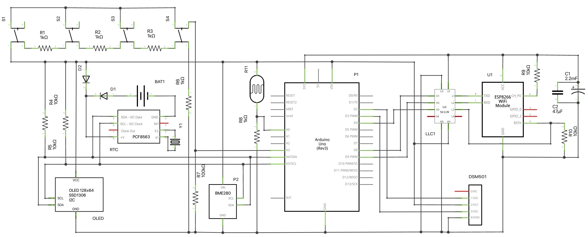

# Sensor Pod

`Sensor Pod` is an [`Arduino Uno`](https://www.arduino.cc/en/Main/arduinoBoardUno&gt;) and [`ESP8266`](https://www.espressif.com/en/products/socs/esp8266) project. The `ESP8266` acts as a relay for the `Uno` to synchronize time over `NTP`, retrieve current weather conditions from the [National Weather Service](https://www.weatheer.gov) and the [Environmental Protection Agency](https://www.epa.gov/enviro/envirofacts-data-service-api), and posting sensor readings.

`Sensor Pod` takes the following readings:

- Temperature
- Humidity
- Pressure
- Brightness
- Air quality (PM<sub>2.5</sub> and AQI)

The projects includes a `PHP` page for `Sensor Pod` to post to and that will graph with [`Google Charts`](https://developers.google.com/chart/) the readings when accessed from a web browser. The latter is demonstrated in the image below.


## Schematic



## Parts List

label|part
-----|----
|BAT1|coin cell battery|
|C1|2.2mF electrolytic capacitor|
|C2|47uF ceramic capacitor|
|D1|diode|
|D2|diode|
|DSM501|DSM501|
|LLC1|logic level converter|
|OLED|128x64 OLED|
|P1|Arduino Uno|
|P2|BME280|
|R1|1kΩ resistor|
|R2|1kΩ resistor|
|R3|1kΩ resistor|
|R4|10kΩ resistor|
|R5|10kΩ resistor|
|R6|1kΩ resistor|
|R7|100kΩ resistor|
|R8|1kΩ resistor|
|R9|10kΩ resistor|
|R10|10kΩ resistor|
|R11|photo cell|
|RTC|PCF8563|
|S1|push button|
|S2|push button|
|S3|push button|
|S4|push button|
|U1|ESP8266|
|Y1|32.768kHz crystal|

## Code

The `Uno` and `ESP8622` code is separted into two directories and is written in `C++`. It can be compiled and uploaded using either the `Arduino IDE` or `PlatformIO`. The table below lists `Sensor Pod`'s library dependencies together with the functionality they provide.

|ESP8622| |Uno| |
--------|-|---|-|
|*library*|*functionality*|*library*|*functionality*|
|`ArduinoOTA`|over-the-air updates|Arduino|`Arduino` support|
|`ArduinoJSON`|JSON support|[u8x8lib](https://github.com/olikraus/u8g2)|`OLED` `I2C` display routines|
|`ESP8266ClientSecure`|secure web requests|`Wire`|`I2C` communication|
|`ESP8266WiFi`|WiFi control|`Adafruit_BME280`|BME280 communication|
|`ESP8266mDNS`|multi-cast DNS support|`AltSoftSerial`|2nd serial communication port|
|`TZ`|timezone information|||
|`coredecls`|NTP callback support|||
|`time`|deal with time|||

## Usage

The `OLED`, connected via `I2C`, can cycle through four different screens: *1)* clock, *2)* current weather conditions, *3)* sensor readings, and *4)* status.

`HTTP` codes are used to relay status, with `408` representing a request timed out and `200` for success.

`Sensor Pod` is controlled using its four button. The table below lists their function.

|button|function|
-------|---------
|1|toggle on/off `OLED`|
|2|post sensor data|
|3|update UV data|
|4|cycle screen|

The `PHP` script `SensorPod.php` should be made accessible via a web server for `Sensor Pod` to be able to post sensor readings to it, which it is set up to do every 15min. Posted sensor data is stored in a `MySQL` table. The `PHP` script assumes a `MySQL` server is running on `localhost` and can be accessed with the username/password combination *arduino*/*sketch*. The sensor data will be stored in a database named *sensor*, in the *readings* table that can be created with the following SQL:

```SQL
CREATE TABLE `readings` (
  `timestamp` datetime NOT NULL,
  `temperature` float DEFAULT NULL,
  `humidity` float DEFAULT NULL,
  `photo` float DEFAULT NULL,
  `pm2_5` float DEFAULT NULL,
  `aqi2_5` float DEFAULT NULL,
  `pressure` float DEFAULT NULL,
  PRIMARY KEY (`timestamp`)
) ENGINE=InnoDB DEFAULT CHARSET=utf8mb4 COLLATE=utf8mb4_unicode_ci;
```

## Notes

1. Vin is assumed to be at 5V, otherwise use the 5V power pin directly.
2. `SSID` and `WiFi` password are configured in the `ESP8622` `C++` code.
3. Update the `hostname` in `post_handler` to your location of `SensorPod.php` in the `Uno` `C++` code.
4. Set the `ZIP` code in `relayUVIdx` to your location in the `ESP8622` `C++` code.
5. The `SHA-1` `fingerprint` for the [National Weather Service](https://www.weatheer.gov) in `relayWeatherFC` needs regular updating in the `ESP8622` `C++` code.

## BSD-3 License

Redistribution and use in source and binary forms, with or without modification, are permitted provided that the following conditions are met:

1. Redistributions of source code must retain the above copyright notice, this list of conditions and the following disclaimer.

2. Redistributions in binary form must reproduce the above copyright notice, this list of conditions and the following disclaimer in the documentation and/or other materials provided with the distribution.

3. Neither the name of the copyright holder nor the names of its contributors may be used to endorse or promote products derived from this software without specific prior written permission.

THIS SOFTWARE IS PROVIDED BY THE COPYRIGHT HOLDERS AND CONTRIBUTORS "AS IS" AND ANY EXPRESS OR IMPLIED WARRANTIES, INCLUDING, BUT NOT LIMITED TO, THE IMPLIED WARRANTIES OF MERCHANTABILITY AND FITNESS FOR A PARTICULAR PURPOSE ARE DISCLAIMED. IN NO EVENT SHALL THE COPYRIGHT HOLDER OR CONTRIBUTORS BE LIABLE FOR ANY DIRECT, INDIRECT, INCIDENTAL, SPECIAL, EXEMPLARY, OR CONSEQUENTIAL DAMAGES (INCLUDING, BUT NOT LIMITED TO, PROCUREMENT OF SUBSTITUTE GOODS OR SERVICES; LOSS OF USE, DATA, OR PROFITS; OR BUSINESS INTERRUPTION) HOWEVER CAUSED AND ON ANY THEORY OF LIABILITY, WHETHER IN CONTRACT, STRICT LIABILITY, OR TORT (INCLUDING NEGLIGENCE OR OTHERWISE) ARISING IN ANY WAY OUT OF THE USE OF THIS SOFTWARE, EVEN IF ADVISED OF THE POSSIBILITY OF SUCH DAMAGE.
