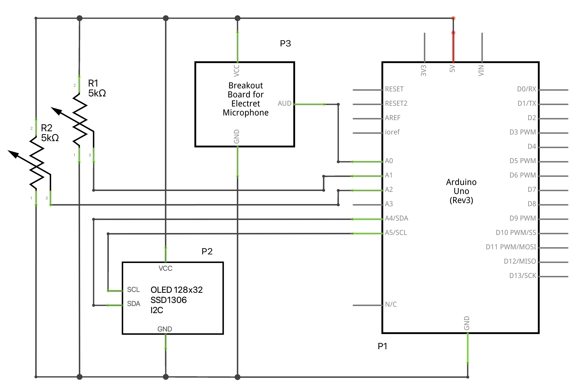

# Spectrum Analyzer

`Spectrum Analyzer` is an [`Arduino Uno`](https://www.arduino.cc/en/Main/arduinoBoardUno&gt;) project for analyzing sound received through a microphone (272-1970 `Hz`). The `OLED`, connected via `I2C`, shows the result of the analysis.

## Schematic

## Parts List

label|part
-----|----
|P1|Arduino Uno|
|P2|OLED|
|P3|microphone|
|R1|5kΩ rotary potentiometer|
|R2|5kΩ rotary potentiometer|

## Code

The code is written in `C++` and can be compiled and uploaded to the `UNO` using either the `Arduino IDE` or `PlatformIO`. The table below lists `Spectrum Analyzer`'s library dependencies together with the functionality they provide.

|library|functionality|
--------|--------------
|`Arduino`|`Arduino` support |
|`Wire`|`I2C` communication|
|[`u8g2lib`](https://github.com/olikraus/u8g2)|`OLED` `I2C` display routines|
|`arduinoFFT`|`FFT` for Spectrum analysis|

## Usage

The two rotary potentiometers control sensitivity and threshold. Their current values are indicated on the `OLED`, in %.

## Notes

1. The sample rate is 4000 `Hz` (every 250µs) and waits until 64 samples are collected, i.e., sound is analyzed every 16ms.
2. The `Uno` hasn't got enough memory to analyze a larger sample.

## BSD-3 License

Redistribution and use in source and binary forms, with or without modification, are permitted provided that the following conditions are met:

1. Redistributions of source code must retain the above copyright notice, this list of conditions and the following disclaimer.

2. Redistributions in binary form must reproduce the above copyright notice, this list of conditions and the following disclaimer in the documentation and/or other materials provided with the distribution.

3. Neither the name of the copyright holder nor the names of its contributors may be used to endorse or promote products derived from this software without specific prior written permission.

THIS SOFTWARE IS PROVIDED BY THE COPYRIGHT HOLDERS AND CONTRIBUTORS "AS IS" AND ANY EXPRESS OR IMPLIED WARRANTIES, INCLUDING, BUT NOT LIMITED TO, THE IMPLIED WARRANTIES OF MERCHANTABILITY AND FITNESS FOR A PARTICULAR PURPOSE ARE DISCLAIMED. IN NO EVENT SHALL THE COPYRIGHT HOLDER OR CONTRIBUTORS BE LIABLE FOR ANY DIRECT, INDIRECT, INCIDENTAL, SPECIAL, EXEMPLARY, OR CONSEQUENTIAL DAMAGES (INCLUDING, BUT NOT LIMITED TO, PROCUREMENT OF SUBSTITUTE GOODS OR SERVICES; LOSS OF USE, DATA, OR PROFITS; OR BUSINESS INTERRUPTION) HOWEVER CAUSED AND ON ANY THEORY OF LIABILITY, WHETHER IN CONTRACT, STRICT LIABILITY, OR TORT (INCLUDING NEGLIGENCE OR OTHERWISE) ARISING IN ANY WAY OUT OF THE USE OF THIS SOFTWARE, EVEN IF ADVISED OF THE POSSIBILITY OF SUCH DAMAGE.
